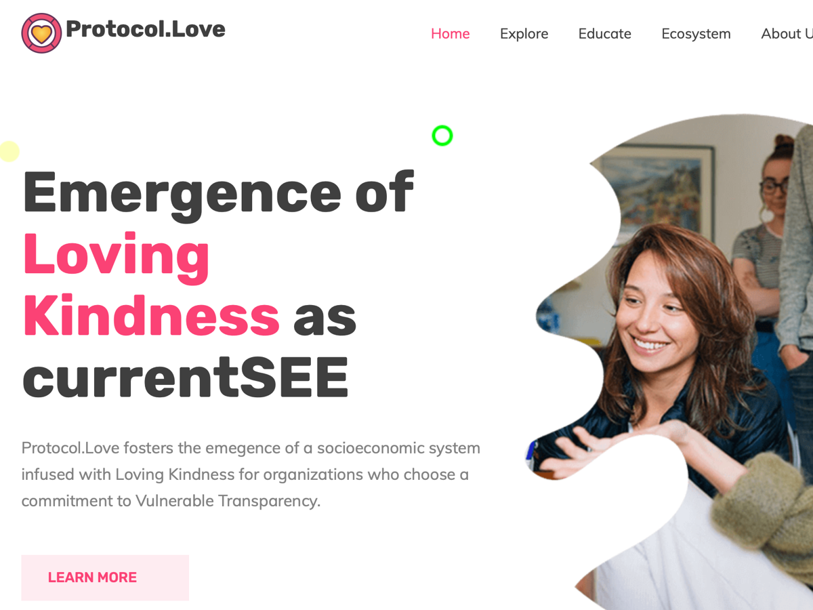

# GoGov.Love Web stack
Serves as CoGov.tech and Protocol.Love web stacks as a WP Network

This is a simple starter project to get the Protocol.Love and CoGov content on a Wordpress platform, connected to a GraphQL server to serve as a federated data API for Holochain integration.

The server is currently configured at the following root domain, and additional domains are then mapped into the Network Sites themselves, such as `cogov.tech` and `protocol.love` being mapped on the `cogov.love` WP Network. 

http://cogov.love

> Shared data and theming with distinct designs and autonomy 

## Projects
- `wp-site` - Wordpress platform (custom code only) for content site(s)
- `graphql` - Protocol.Love Apollo Bridge for a federated GraphQL API
- `webapp` - [Svelte](https://svelte.dev)/[Sapper](https://sapper.svelte.dev) as hApp frontend for protocol.love main web interface

## Features:

- Current content engine is built on [Wordpress](https://gatsbyjs.org)
- Structured content and custom site builder using a customized [Wordpress theme/plugin](https://wordpress.org) instance and [Elementor](https://elementor.com), using a [GraphQL connector](https://www.wpgraphql.com) to expose a [common (graphql) data API](https://engine.apollographql.com/graph/WP-Network/settings?schemaTag=current). 
  - Open source tools, free tier for three users (Wordpress, Apollo, WP plugins)
  - Passwords for systems are in CoGov Workflowy, or elsehwere (see admins)
- A super fast common theme with landing pages, page parts, navigation, custom taxonomy, and blog
- Global deployment on shared hosting server on Namecheap (cPanel managed)
- Create landing pages and use custom page building components for custom web frontend
- Wordpress Multisite with custom plugins/conmfiguration for security, data integrity, profile management, content design, marketing, and more

## Quick start

1. Clone this repository
2. `git clone git@github.com:cogov/protocol-love.git`
3. `yarn install` to install dependencies
4. more to come on this...

## Deploy changes


## Next steps
Documentation - also see individual projects README's in this (mono)repo


## Git submodules
It is sometimes annoying if you forget to initiate and update submodules because the code doesn't appear at first. Fortunately, there are some tricks to make it easier:

```git submodule update --init```
This will update the submodules, and if they're not initiated yet, will initiate them.

- graphql
- wp-site/web
  
You can also have submodules inside of submodules. In this case you'll want to update/initiate the submodules recursively:

```git submodule update --init --recursive```
This is a lot to type, so you can make an alias:

```git config --global alias.update '!git pull && git submodule update --init --recursive'```


## What it may like

---

